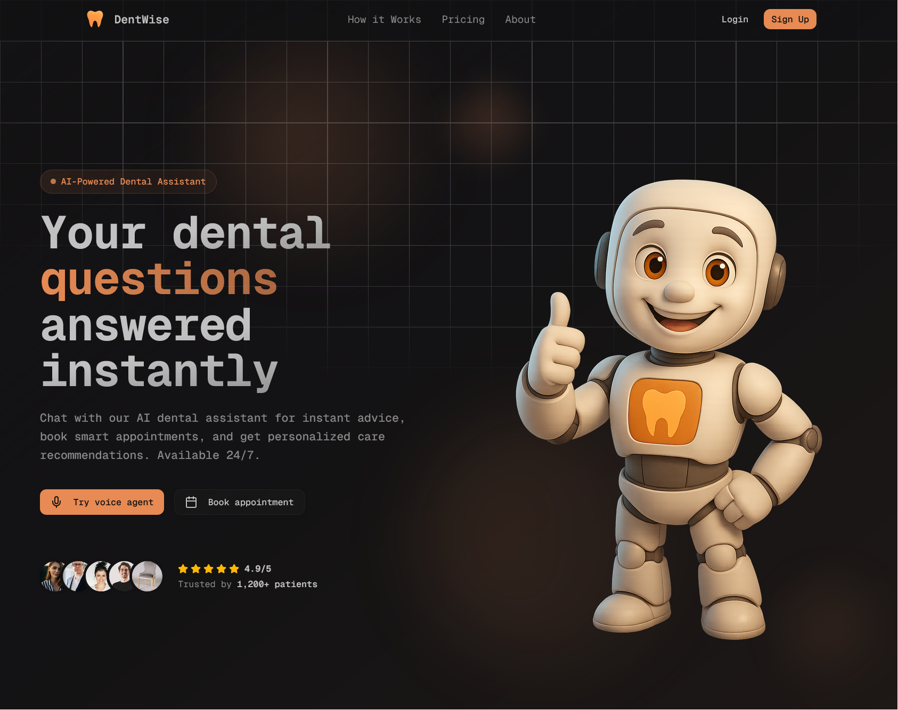
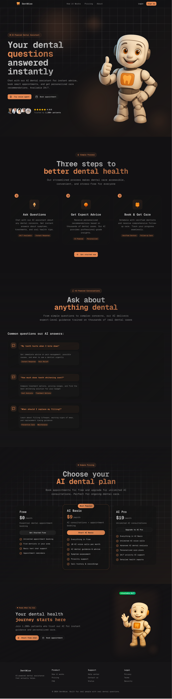
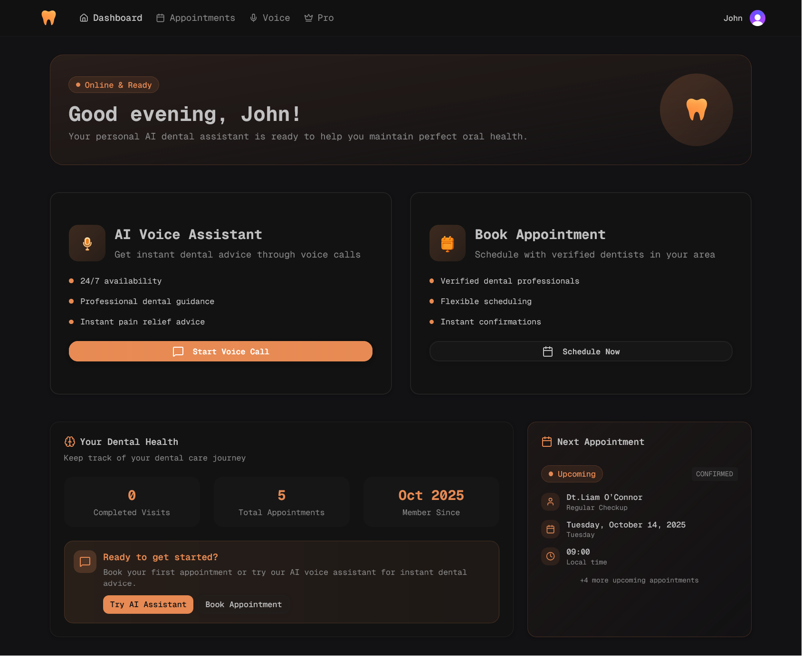
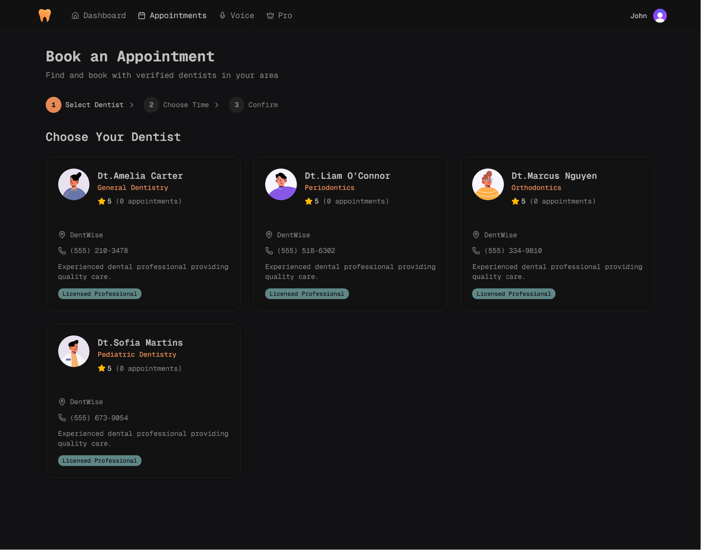
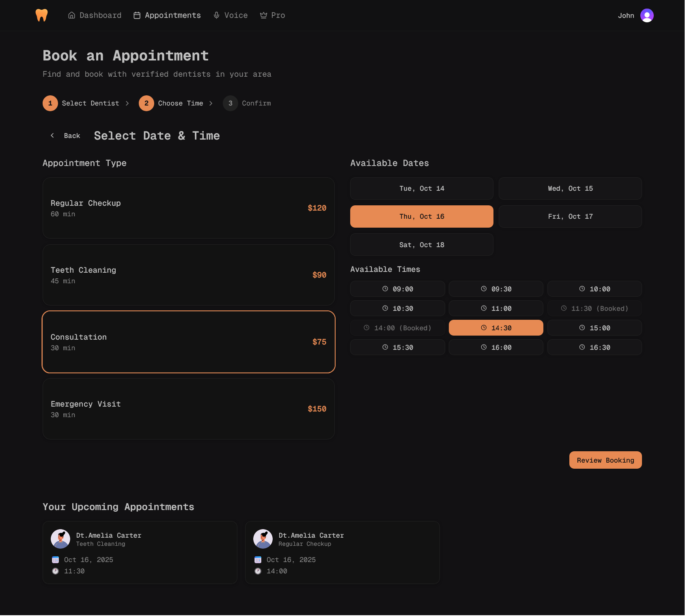
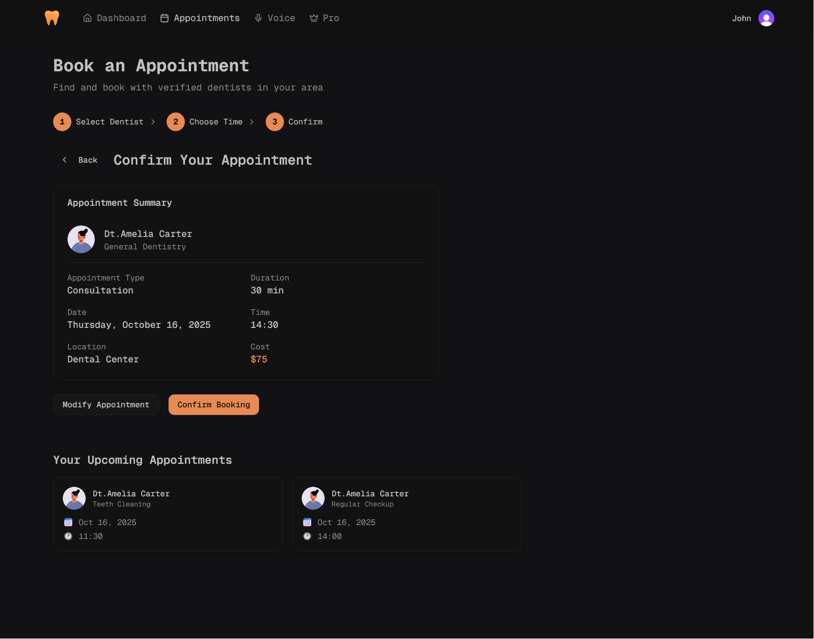
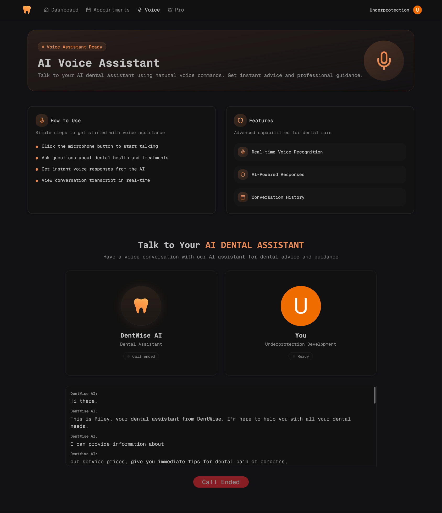
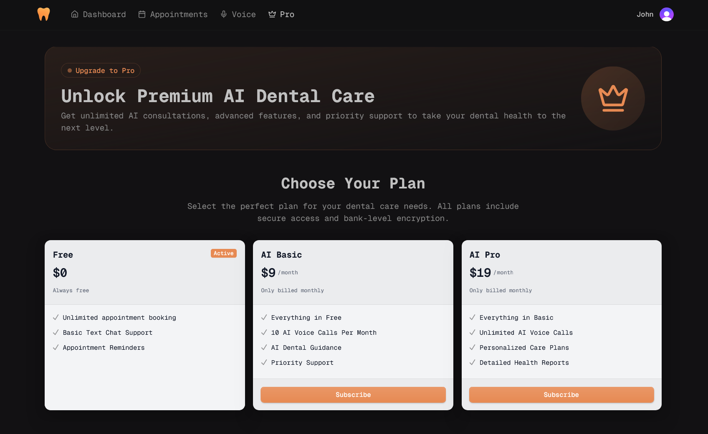
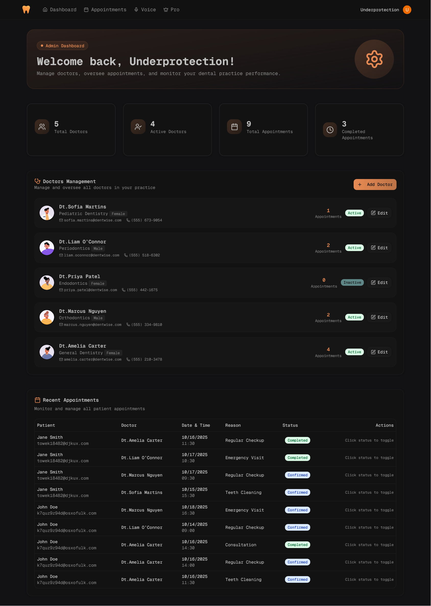

<div align="center">
  <h1>DentWise — AI‑Powered Dental Assistant 🚀</h1>

  <p>Run voice AI consultations with real‑time transcription, smart appointment booking, automatic email confirmations, and a powerful admin dashboard. Create seamless patient experiences with voice‑first interactions — type‑safe and production‑ready.</p>
</div>



<div align="center">

[](https://nextjs.org/)
[](https://www.typescriptlang.org/)
[](https://tailwindcss.com/)
[](https://ui.shadcn.com/)
[](https://www.prisma.io/)
[](https://www.postgresql.org/)
[](https://clerk.com/)
[](https://tanstack.com/query)
[](https://resend.com/)
[](https://vapi.ai/)
[](https://lucide.dev/)

</div>

## ✨ Features

<div align="center">

| Feature                      | Description                                                                |
| ---------------------------- | -------------------------------------------------------------------------- |
| 🔐 Authentication            | Sign in with email/password or social (GitHub, Google) via Clerk           |
| 🎙️ Voice AI Consultations    | Real‑time voice calls with Vapi AI, live transcription & speaking state    |
| 📅 Smart Appointment Booking | Multi‑step booking flow with doctor selection, time slots, and visit types |
| 📧 Email Confirmations       | Automatic appointment confirmations sent via Resend                        |
| 📊 Patient Dashboard         | Health overview, upcoming appointments, and quick actions                  |
| 👨‍⚕️ Admin Dashboard           | Manage doctors, view appointment statistics, and system overview           |
| 💳 Billing & Upgrades        | Pro plan with enhanced features and usage limits                           |
| 🎨 Modern UI                 | Responsive design with Tailwind CSS v4 + shadcn/ui components              |
| 🔒 Type‑Safe APIs            | End‑to‑end type safety with Prisma + TypeScript                            |
| 📱 Responsive Design         | Optimized for desktop, tablet, and mobile devices                          |

</div>

## 🌟 Tech Highlights

- **Voice AI Integration**: Vapi Web SDK powers real‑time voice consultations with live transcription
- **Smart Appointment System**: Multi‑step booking flow with doctor availability and time slot management
- **Automatic Email Notifications**: Resend integration sends professional appointment confirmations
- **Type‑Safe Everything**: Prisma ORM + TypeScript across the entire stack
- **Production‑Ready Auth**: Clerk authentication with email/password and social providers
- **Admin Control Panel**: Comprehensive dashboard for managing doctors and viewing analytics

## 🚀 Quick Start

```bash
# Clone the repository
git clone https://github.com/yourusername/dentwise-ai.git
cd dentwise-ai

# Install dependencies
npm install
# or
pnpm install

# Create your .env from the variables below and fill the values

# Push database schema
npx prisma db push

# Start the development server
npm run dev
# or
pnpm dev
```

Visit [http://localhost:3000](http://localhost:3000) to use the application.

## 🛠️ Tech Stack

<details>
  <summary>Click to expand tech stack details</summary>

### Core Frameworks & Libraries

- **[Next.js](https://nextjs.org/)** – App Router, server components, Turbopack
- **[React](https://react.dev/)** – UI library (v19)
- **[TypeScript](https://www.typescriptlang.org/)** – Types everywhere
- **[React Hook Form](https://react-hook-form.com/)** – Performant forms
- **[TanStack Query](https://tanstack.com/query/latest)** – Client data fetching/caching
- **[TanStack Table](https://tanstack.com/table/latest)** – Powerful tables

### Backend & Database

- **[Prisma ORM](https://www.prisma.io/)** – Type‑safe queries and migrations
- **[PostgreSQL](https://www.postgresql.org/)** – Primary database
- **[Neon](https://neon.tech/)** – Serverless Postgres (optional)

### AI & Voice

- **[Vapi AI](https://vapi.ai/)** – Real‑time voice AI consultations
- **[Vapi Web SDK](https://docs.vapi.ai/)** – Browser‑based voice calls with transcription

### Auth & Email

- **[Clerk](https://clerk.com/)** – Authentication with email/password and social login
- **[Resend](https://resend.com/)** – Transactional email service

### UI & Styling

- **[Tailwind CSS](https://tailwindcss.com/)** – Utility‑first CSS (v4)
- **[shadcn/ui](https://ui.shadcn.com/)** – Composable components (Radix UI)
- **[Lucide](https://lucide.dev/)** – Icon set
- **[next-themes](https://github.com/pacocoursey/next-themes)** – Dark mode support

### Development Tools

- **[Biome](https://biomejs.dev/)** – Linting and formatting
- **[Prisma Studio](https://www.prisma.io/studio)** – Database GUI

</details>

## 📸 Screenshots

<div align="center">

### 🏠 Landing Page



### 📊 Dashboard



### 📅 Appointment Booking





### 🎙️ Voice Consultation



### 💰 Pro



### 👨‍⚕️ Admin Dashboard



</div>

## 🔐 Environment Variables

Create a `.env` file in the project root and add the variables below.

| Variable                            | Description                  | Used In        |
| ----------------------------------- | ---------------------------- | -------------- |
| `NEXT_PUBLIC_APP_URL`               | Base URL for the application | Next.js        |
| `DATABASE_URL`                      | Postgres connection string   | Prisma         |
| `NEXT_PUBLIC_VAPI_API_KEY`          | Vapi Web SDK API key         | Vapi (browser) |
| `NEXT_PUBLIC_VAPI_ASSISTANT_ID`     | Vapi assistant ID            | Voice calls    |
| `CLERK_SECRET_KEY`                  | Clerk backend secret         | Clerk (server) |
| `NEXT_PUBLIC_CLERK_PUBLISHABLE_KEY` | Clerk publishable key        | Clerk (client) |
| `RESEND_API_KEY`                    | Resend API key               | Email sending  |
| `ADMIN_EMAIL`                       | Admin access email           | Admin page     |

```env
# App URL
NEXT_PUBLIC_APP_URL=http://localhost:3000

# Database
DATABASE_URL=

# Vapi AI
NEXT_PUBLIC_VAPI_API_KEY=
NEXT_PUBLIC_VAPI_ASSISTANT_ID=

# Clerk Auth
CLERK_SECRET_KEY=
NEXT_PUBLIC_CLERK_PUBLISHABLE_KEY=

# Resend Email
RESEND_API_KEY=

# Admin Access
ADMIN_EMAIL=
```

**Notes:**

- Admin page is restricted by `ADMIN_EMAIL`, matched against the signed‑in user's email
- Email sending is for demo/testing; configure proper domains in production
- Voice calls start via `vapi.start(process.env.NEXT_PUBLIC_VAPI_ASSISTANT_ID)`

## 📦 Scripts

| Command          | Description                                     |
| ---------------- | ----------------------------------------------- |
| `npm run dev`    | Start development server with Turbopack         |
| `npm run build`  | Generate Prisma client and build for production |
| `npm run start`  | Start production server                         |
| `npm run lint`   | Run Biome linting checks                        |
| `npm run format` | Format code with Biome                          |
